# System Architecture Diagram

```mermaid
graph TD
    %% Chrome Extension Components
    subgraph "Chrome Extension"
        direction TB
        
        subgraph "Popup Interface"
            PH[popup.html]
            PJ[popup.js]
            SM[SettingsManager.js]
            SD[StatsDisplay.js]
        end
        
        subgraph "Content Script"
            CS[content-script.js]
            BD[BiasDetector.js]
        end
        
        subgraph "Configuration Layer"
            BC[BiasConfig.js]
            BP[BiasPatterns.js]
        end
        
        subgraph "Detection Engine"
            ED[ExcellenceDetector.js]
            DP[DOMProcessor.js]
            HCG[HoverContentGenerator.js]
            PM[PerformanceMonitor.js]
        end
        
        subgraph "Pattern Dictionaries"
            OW[opinion-words.js]
            TB[tobe-verbs.js]
            AW[absolute-words.js]
            WP[weasel-phrases.js]
            PL[probability-language.js]
            WM[war-metaphors.js]
            EU[euphemisms.js]
            ET[emotional-triggers.js]
            GL[gaslighting.js]
            FD[false-dilemma.js]
            FB[false-balance.js]
            MM[minimizers.js]
            MX[maximizers.js]
            PM2[presupposition-markers.js]
            PP[passive-patterns.js]
        end
    end
    
    %% External Components
    subgraph "Web Page"
        DOM[Document Object Model]
        TN[Text Nodes]
        HL[Highlighted Elements]
        HC[Hover Cards]
    end
    
    subgraph "Chrome Storage"
        SS[Sync Storage]
        LS[Local Storage]
    end
    
    %% Connections
    PJ --> SM
    PJ --> SD
    SM --> SS
    SM --> CS
    CS --> BD
    BD --> BC
    BD --> BP
    BD --> ED
    BD --> DP
    BD --> HCG
    BD --> PM
    
    BP --> OW
    BP --> TB
    BP --> AW
    BP --> WP
    BP --> PL
    BP --> WM
    BP --> EU
    BP --> ET
    BP --> GL
    BP --> FD
    BP --> FB
    BP --> MM
    BP --> MX
    BP --> PM2
    BP --> PP
    
    DP --> DOM
    DP --> TN
    DP --> HL
    HCG --> HC
    
    CS --> SS
    SD --> CS
    
    %% Styling
    classDef popup fill:#e1f5fe
    classDef content fill:#f3e5f5
    classDef config fill:#e8f5e8
    classDef engine fill:#fff3e0
    classDef patterns fill:#fce4ec
    classDef external fill:#f5f5f5
    
    class PH,PJ,SM,SD popup
    class CS,BD content
    class BC,BP config
    class ED,DP,HCG,PM engine
    class OW,TB,AW,WP,PL,WM,EU,ET,GL,FD,FB,MM,MX,PM2,PP patterns
    class DOM,TN,HL,HC,SS,LS external
```

## Key Components

### **Popup Interface Layer**
- **popup.html/js**: User interface for settings and statistics
- **SettingsManager.js**: Handles Chrome storage and settings validation
- **StatsDisplay.js**: Manages statistics display and updates

### **Content Script Layer**
- **content-script.js**: Main entry point, message handling, lifecycle management
- **BiasDetector.js**: Core detection orchestrator and analysis coordinator

### **Configuration Layer**
- **BiasConfig.js**: Centralized configuration management for all bias types
- **BiasPatterns.js**: Pattern compilation and regex management system

### **Detection Engine**
- **ExcellenceDetector.js**: Identifies positive writing patterns
- **DOMProcessor.js**: DOM manipulation and text highlighting
- **HoverContentGenerator.js**: Creates hover cards and tooltips
- **PerformanceMonitor.js**: Tracks performance metrics

### **Pattern Dictionaries**
- 15 specialized dictionaries containing linguistic patterns
- Each focused on specific bias types (opinion, probability, euphemisms, etc.)
- Compiled into regex patterns for efficient matching

## Data Flow Summary
1. **Settings** flow from popup → Chrome Storage → content script
2. **Detection** processes DOM text through pattern matching
3. **Results** create highlights and update statistics
4. **User interactions** trigger re-analysis or setting changes