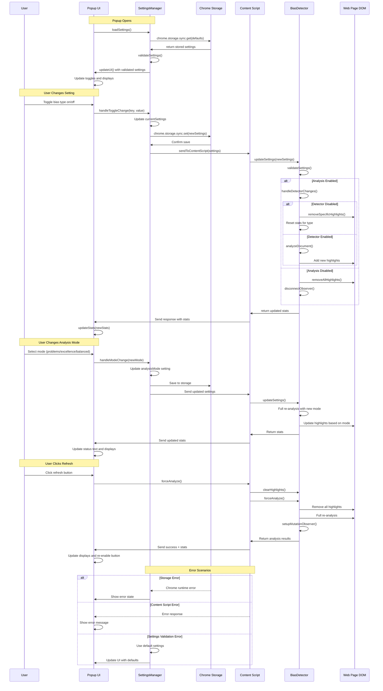
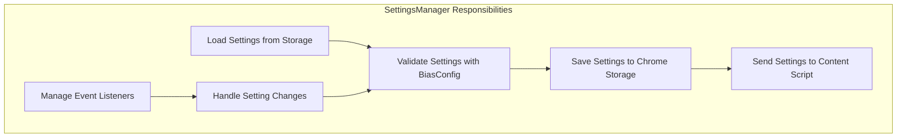
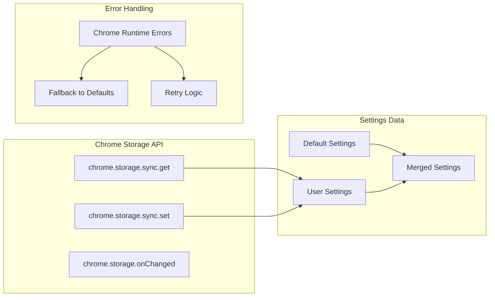

# Settings Management Flow



## Settings Flow Components

### **1. Settings Manager (popup/SettingsManager.js)**


### **2. Settings Validation Process**
```mermaid
flowchart TD
    START[Settings Input]
    VALIDATE[BiasConfig.validateSettings()]
    
    %% Check each setting
    LOOP[For Each Setting Key]
    TYPE{Setting Type?}
    
    %% Different validation paths
    ENABLE[enableAnalysis: Boolean]
    MODE[analysisMode: String Enum]
    BIAS[Bias Type: Boolean]
    EXCEL[Excellence Type: Boolean]
    
    %% Validation results
    VALID{Valid?}
    DEFAULT[Use Default Value]
    KEEP[Keep User Value]
    
    %% Final result
    RESULT[Validated Settings Object]
    
    START --> VALIDATE
    VALIDATE --> LOOP
    LOOP --> TYPE
    
    TYPE -->|enableAnalysis| ENABLE
    TYPE -->|analysisMode| MODE
    TYPE -->|bias setting| BIAS
    TYPE -->|excellence setting| EXCEL
    
    ENABLE --> VALID
    MODE --> VALID
    BIAS --> VALID
    EXCEL --> VALID
    
    VALID -->|No| DEFAULT
    VALID -->|Yes| KEEP
    
    DEFAULT --> LOOP
    KEEP --> LOOP
    LOOP --> RESULT
```

### **3. Chrome Storage Integration**


## Key Features

### **Settings Validation**
- All settings validated against BiasConfig schema
- Invalid values replaced with defaults
- Type checking (boolean, string enums)
- Ensures only valid bias types are enabled

### **Persistent Storage**
- Uses Chrome's sync storage for cross-device settings
- Automatic fallback to defaults on storage errors
- Validation on every load and save operation

### **Real-time Updates**
- Changes immediately sent to content script
- Selective re-analysis based on what changed
- UI updates reflect current state

### **Error Recovery**
- Chrome storage errors handled gracefully
- Content script communication failures retry
- Invalid settings corrected automatically

### **Performance Optimizations**
- Settings cached in memory during popup session
- Debounced updates prevent excessive processing
- Batch setting changes when possible