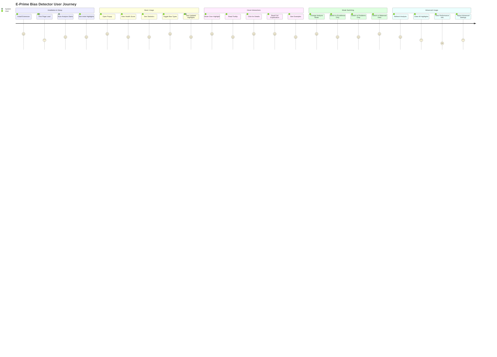
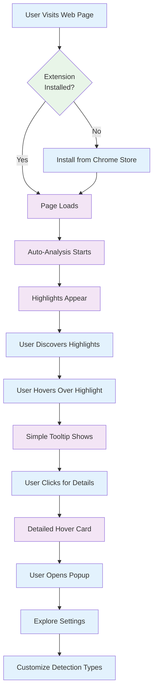
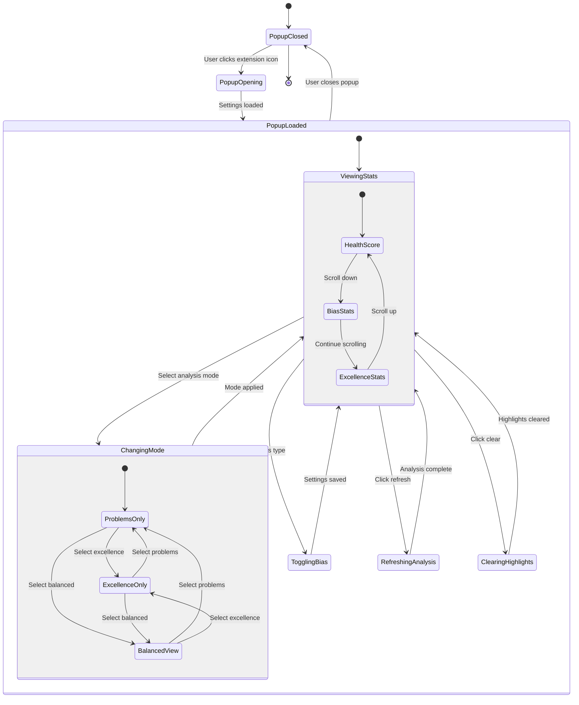
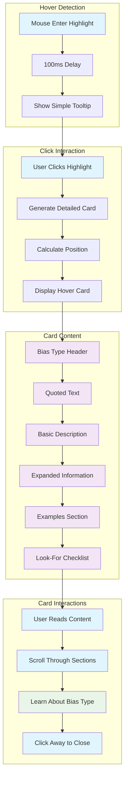
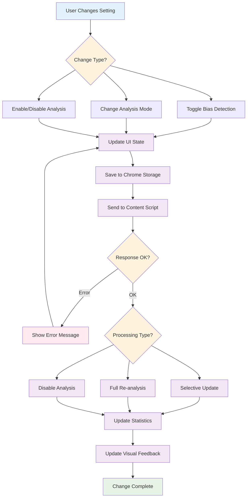

# User Interaction Flow

## Detailed User Interaction Flows

### **1. Initial User Experience**

### **2. Popup Interface Interactions**

### **3. Hover Card Interaction System**

### **4. Settings Change Flow**

## User Experience Principles

### **Progressive Disclosure**
1. **Initial**: Simple tooltips on hover
2. **Detailed**: Rich hover cards on click
3. **Advanced**: Full settings in popup

### **Real-time Feedback**
- Instant UI updates on setting changes
- Visual feedback during processing
- Clear error messages for failures

### **Non-intrusive Design**
- Highlights blend naturally with page content
- Popup interface is compact and focused
- Hover cards appear only on user interaction

### **Educational Focus**
- Explanations help users understand bias types
- Examples show problematic vs. acceptable usage
- Contextual guidance for different content types

### **Performance Awareness**
- Smooth interactions despite heavy processing
- Debounced updates prevent interface lag
- Background processing doesn't block user actions