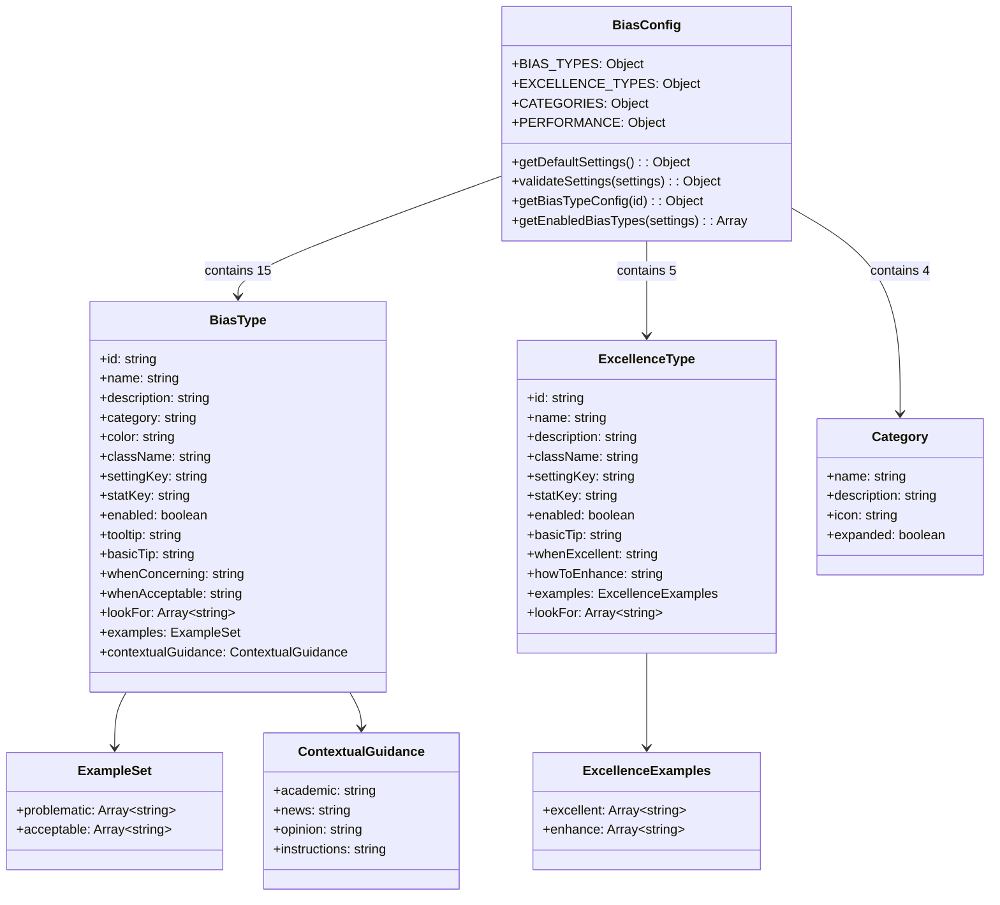
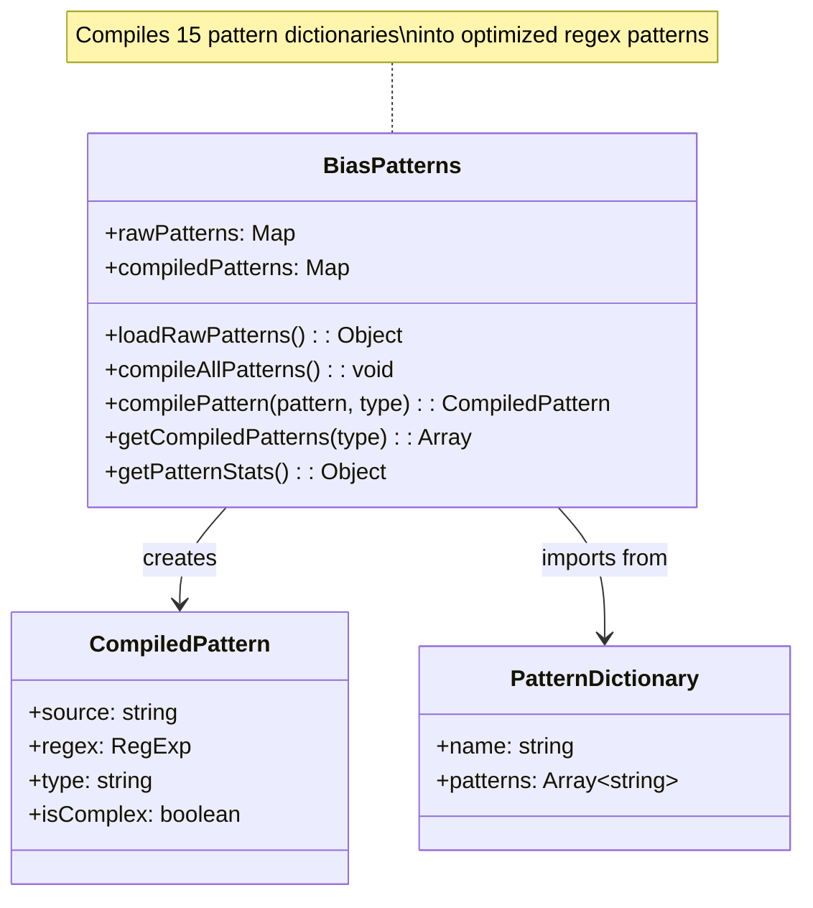
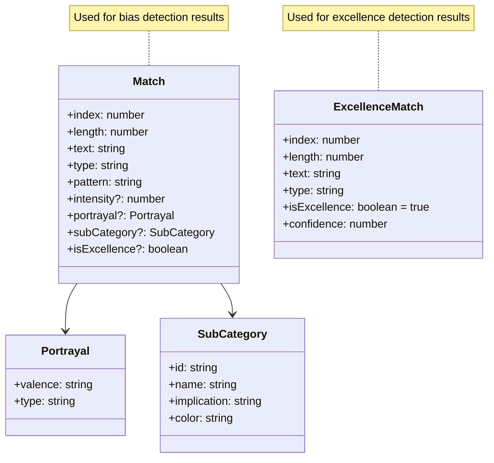
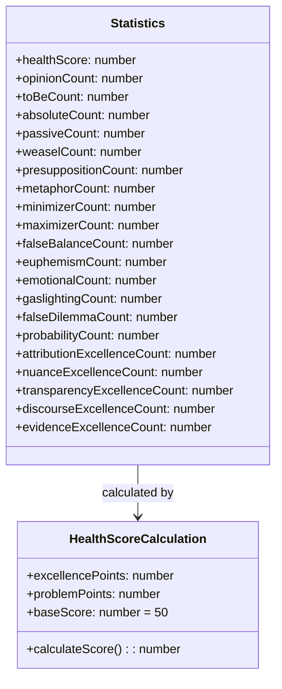
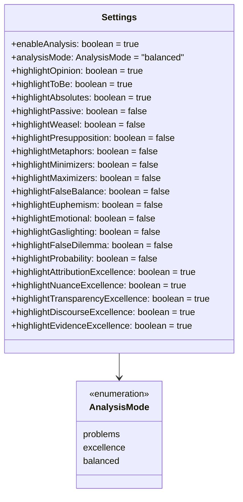
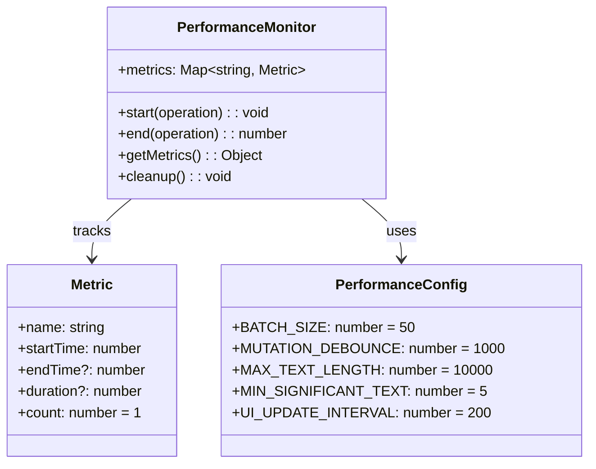
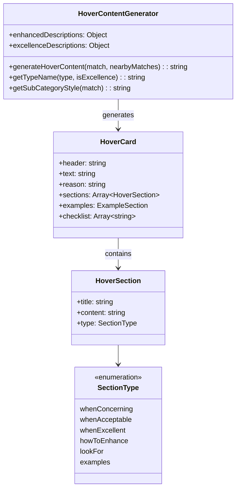
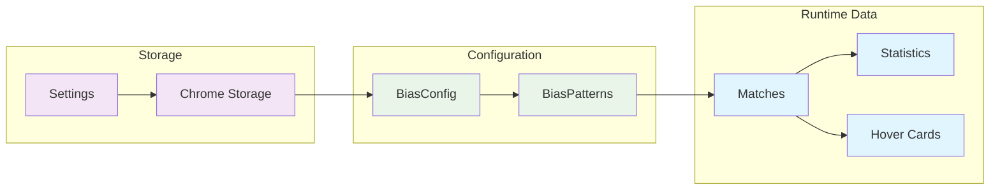

# Data Structures & Configuration Schema

## 1. BiasConfig Data Structure

## 2. Pattern Matching System

## 3. Detection Match Data Structure

## 4. Statistics & Health Scoring

## 5. Settings Schema

## 6. Performance Monitoring

## 7. Hover Card System

## Data Flow Summary

## Key Design Principles

### **Centralized Configuration**
- Single source of truth in BiasConfig
- Type-safe structure with validation
- Extensible for new bias types

### **Efficient Pattern Matching**
- Pre-compiled regex patterns
- Optimized for performance
- Supports both simple and complex patterns

### **Rich Match Data**
- Comprehensive match information
- Sub-categorization support
- Intensity and portrayal analysis

### **Flexible Settings**
- Granular control over detection types
- Multiple analysis modes
- Persistent storage with validation

### **Performance Awareness**
- Configurable performance thresholds
- Batch processing parameters
- Monitoring and metrics collection